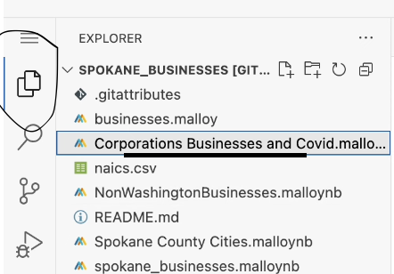

# Spokane Businesses

This repository contains data and analysis related to businesses in Spokane County, Washington. The project includes datasets and scripts for exploring business information, classifications, and the impact of COVID-19 on local enterprises.It helps paint a picture of which sectors are thriving, how long businesses tend to remain active, and how frequently they change ownership or location. Understanding these patterns is not only essential for city planners and economic developers but also for entrepreneurs deciding whether to open a new venture in the region.

Years covered
The data covers a timespan for businesses that commenced between 1905 – 2025.

## Repository Contents

- **Datasets**:
  - `SpokaneCounty-Businesses.csv`: A dataset of businesses located in Spokane County.
  - `naics.csv`: North American Industry Classification System (NAICS) codes and descriptions.
  - `states.csv`: Information about U.S. states.
  
- **Analysis Scripts**:
  - `businesses.malloy`: Has all the sources used in this repository and views that can be used to filter for querying. 
  - `spokane_businesses.malloynb`: Main analysis notebook for exploring Spokane businesses.
  - `Corporations Businesses and Covid.malloynb`: Analysis of corporations, businesses, and COVID-19 impacts.
  - `NonWashingtonBusinesses.malloynb`: Examination of businesses outside Washington state.
  - `Spokane County Cities.malloynb`: Analysis focusing on cities within Spokane County.


   # How to Open a Shared GitHub File and Run Malloy Code
To explore the data and run the analyses:

Click on the (https://github.com/darrenowsley/spokane_businesses.git) provided to access the shared repository or file. 

Once on Github, click Shift + period this will load the web editor. Then install the malloy extension. See images below for reference:
| **Step**   | **Image Preview** |
|--------|-----------|
| `Step 1 - Press allow` |  |
| `Step 2 - Click the Blocks, search for Malloy, install` |  |
| `Step 3 - Click Trust` |  |
| `Step 4 - Click a .malloynb file` |  |
| `Step 5 - Press Run` |  |


## Summary of findings

This project analyzes business trends focusing on:

Business openings and closures over time

Effects of economic crisis e.g COVID-19 on businesses

Ownership structure distribution

Geographic distribution of businesses

Business longevity and failure rates

# 1 Corporation Type & Business Longevity Analysis

This dashboard provides insights into the distribution of corporation types, their visual representation, and trends over the years, along with an analysis of businesses with the longest operating periods.

## Corporation Type Distribution & Trends

```malloy
run: businesses -> {
    -- Companies Grouped by Type
    nest: `Companies Grouped by Type` is {
        group_by: ctype
        aggregate: counted is count()
    }

    -- Visual Representation: Bar Chart of Corporation Type Spread
    # bar_chart
    nest: `Total Companies Grouped by Type Visually` is {
        group_by: ctype
        aggregate: counted is count()
    }

    -- Corporation Types by Year
    nest: `Corporation Type Counted by Year` is {
        group_by: ctype
        aggregate: counted is count()
        
        -- Yearly Breakdown
        # line_chart {y.independent}
        nest: corporation_type_by_year is {
            group_by: Commence_Date.year
            aggregate: counteds is count()
        }
    }
}
```

## Contributing

Contributions are welcome! If you have suggestions or improvements, follow these steps:

- Fork the repository.  
- Create a new branch:  
  ```sh
  git checkout -b feature-branch


## License

This project is licensed under the MIT License. See the [`LICENSE`](LICENSE) file for details.

## Contact

For questions or feedback, please contact the repository owner through GitHub.

---

*Note: This README is based on the repository structure and available files. For detailed information, refer to the individual notebooks and datasets.*


