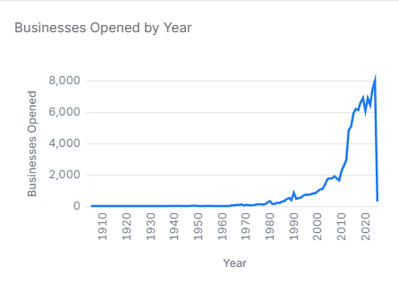

# Spokane Businesses

This repository contains data and analysis related to businesses in Spokane County, Washington. The project includes datasets and scripts for exploring business information, classifications, and the impact of COVID-19 on local enterprises.It helps paint a picture of which sectors are thriving, how long businesses tend to remain active, and how frequently they change ownership or location. Understanding these patterns is not only essential for city planners and economic developers but also for entrepreneurs deciding whether to open a new venture in the region.



Years covered
The data covers a timespan for businesses that commenced between 1905 – 2025.

## Motivation

This data analysis allows one to see what kinds of businesses are in Spokane. It helps paint a picture of which sectors are thriving, how long businesses tend to remain active, and how frequently they change ownership or location. Understanding these patterns is not only essential for city planners and economic developers but also for entrepreneurs deciding whether to open a new venture in the region.


## Repository Contents

- **Datasets**:
  - `SpokaneCounty-Businesses.csv`: A dataset of businesses located in Spokane County.
  - `naics.csv`: North American Industry Classification System (NAICS) codes and descriptions.
  - `states.csv`: Information about U.S. states.
  
- **Analysis Scripts**:
  - `businesses.malloy`: Has all the sources used in this repository and views that can be used to filter for querying. 
  - `Bueiness Views Quick Look.malloynb`: Views of the dataset to utilize for quick analysis.
  - `Overview - Business Legal Status.malloynb`: Analysis of corporations, businesses, and COVID-19 impacts.
  - `Overview - Registered businesses with Non WA Addresses.malloynb`: Examination of businesses outside Washington state.
  - `Overview - Spokane City Businesses.malloynb`: Analysis focusing on cities within Spokane County.

## Summary of Findings

This project analyzes business trends focusing on:

Business openings and closures over 
City Trend - In the 1990s, Spokane began to see a diversification of its economy, with a particular focus on the tech and healthcare industries. The expansion of institutions like Providence Health and Spokane's emergence as a regional hub for healthcare services attracted new businesses in the health sector.


Effects of economic crisis e.g COVID-19 on businesses

Ownership structure distribution
In Spokane County, the majority of businesses are organized as Limited Liability Companies (LLCs), with 46,439 businesses falling under this structure. Close behind are individual businesses, accounting for 42,542 entities. Corporations represent 16,037 businesses, while nonprofit corporations make up 3,061 businesses. Other legal structures are less common, with 1,367 businesses categorized as partnerships, 284 as associations, and 206 as Limited Liability Partnerships (LLPs). Limited Partnerships (LPs) number 188, and municipalities account for 183 businesses. Bank corporations and trusts are less frequent, with 135 and 88 businesses, respectively. Joint ventures are represented by 68 businesses, and Limited Liability Limited Partnerships (LLLPs) and Tenants in Common each comprise a smaller share, with 47 and 19 businesses, respectively. Overall, LLCs and individual businesses dominate the business landscape in Spokane County, with other legal forms making up a smaller portion.


The image illustrates how to use the "View" feature to filter specific data. In this example, the "View by Business_Types" was applied and filtered to show only Beauty Salons. To gain further insights, a nested view—"View by Legal Status"—was added, refining the data to display only Beauty Salons that opened between 2022 and 2024. 


The results from the code above show a total of 159 Beauty Salons that opened between 2022 and 2024, categorized by their legal status. Additionally, the results include the percentage each legal status represents out of the total businesses.


Washington is known for its favorable business climate, including no state income tax. This can be very appealing for businesses from neighboring states like California and Idaho, where taxes might be higher. Companies might choose to register in Washington to take advantage of these tax benefits.


   # How to Open a Shared GitHub File and Run Malloy Code
To explore the data and run the analyses:

Click on the (https://github.com/darrenowsley/spokane_businesses.git) provided to access the shared repository or file. 

Once on Github, click Shift + period this will load the web editor. Then install the malloy extension. See images below for reference:
| **Step**   | **Image Preview** |
|--------|-----------|
| `Step 1 - Press allow` |  |
| `Step 2 - Click the Blocks, search for Malloy, install` |  |
| `Step 3 - Click Trust` |  |
| `Step 4 - Click a .malloynb file` |  |
| `Step 5 - Press Run` |  |


# 1 Corporation Type & Business Longevity Analysis

This dashboard provides insights into the distribution of corporation types, their visual representation, and trends over the years, along with an analysis of businesses with the longest operating periods.

## Corporation Type Distribution & Trends

```malloy
run: businesses -> {
    -- Companies Grouped by Type
    nest: `Companies Grouped by Type` is {
        group_by: ctype
        aggregate: counted is count()
    }

    -- Visual Representation: Bar Chart of Corporation Type Spread
    # bar_chart
    nest: `Total Companies Grouped by Type Visually` is {
        group_by: ctype
        aggregate: counted is count()
    }

    -- Corporation Types by Year
    nest: `Corporation Type Counted by Year` is {
        group_by: ctype
        aggregate: counted is count()
        
        -- Yearly Breakdown
        # line_chart {y.independent}
        nest: corporation_type_by_year is {
            group_by: Commence_Date.year
            aggregate: counteds is count()
        }
    }
}
```

## Contributing

Contributions are welcome! If you have suggestions or improvements, follow these steps:

- Fork the repository.  
- Create a new branch:  
  ```sh
  git checkout -b feature-branch


## License

This project is licensed under the MIT License. See the [`LICENSE`](LICENSE) file for details.

The files provided directly from the Spokane Libraries, as government documents, now in the public domain. All other data files have been generated by the Gonzaga University Graduate School of Business as part of the MSBA-622-01 Data Science for Business (Spring 2025) course.


## Contact

For questions or feedback, please contact the repository owner through GitHub.

---

*Note: This README is based on the repository structure and available files. For detailed information, refer to the individual notebooks and datasets.*


